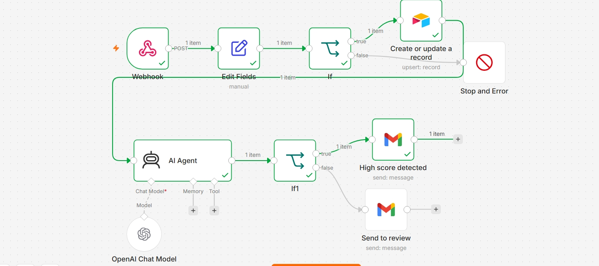

# AI-Lead-Classification-Workflow
AI-powered lead classification workflow built with n8n that analyzes incoming leads, categorizes them based on intent and priority, and automatically routes qualified leads while sending notifications and storing data for efficient follow-up.
The workflow receives lead information through a webhook, including details such as the customer's name, email address, company, phone number, and inquiry message. AI then analyzes the content of the submission to identify the type of inquiry (such as sales, support, partnership, or general inquiry), evaluate the quality of the lead, and assign a classification like Hot, Warm, or Cold based on predefined criteria.

Once the lead has been classified, the workflow automatically routes it to the appropriate team or process. High-priority leads can be forwarded immediately to the sales team via email, while lower-priority or general inquiries can be stored for future follow-up. The workflow also saves all lead information, AI-generated classifications, and reasoning into a database or spreadsheet for reporting and future analysis.

Features
AI-powered lead analysis and classification
Automatic lead qualification based on message content
Categorizes inquiries by intent
Assigns lead priority (Hot, Warm, Cold)
Automated email notifications for qualified leads
Stores classified lead data in Airtable or Google Sheets
Eliminates manual lead screening
Scalable and easy to customize for different business needs
Technologies Used
n8n
OpenAI API
Webhooks
Gmail
Google Sheets / Airtable
JSON
HTTP Requests
Workflow Process
Receive a new lead through a website form.
Capture customer information using a webhook.
Send the lead details to an AI model for analysis.
Classify the lead based on intent and quality.
Assign a priority level.
Route the lead according to its classification.
Send email notifications when required.
Store the lead and AI results for future tracking.
Benefits
Saves time by automating lead qualification.
Responds faster to high-value prospects.
Improves sales team efficiency.
Ensures every lead is categorized consistently.
Reduces manual work and human error.
Provides structured lead data for analytics and reporting.

This project demonstrates how AI and workflow automation can streamline lead management by intelligently classifying customer inquiries, prioritizing opportunities, and automating follow-up processes with minimal human intervention.
##  Screenshots

